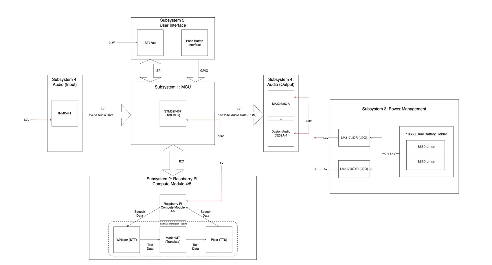
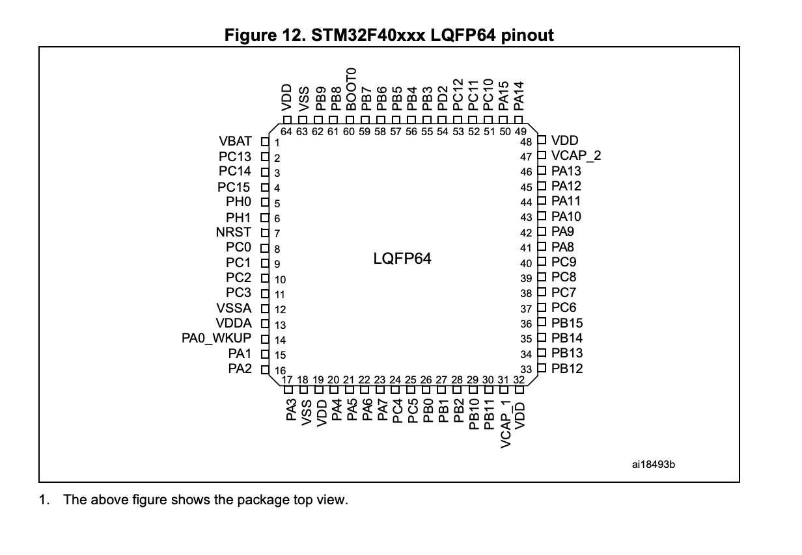
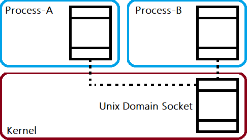
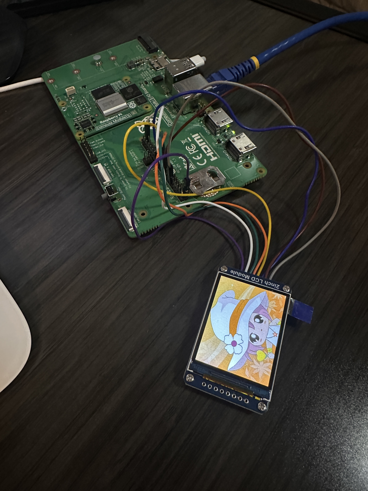
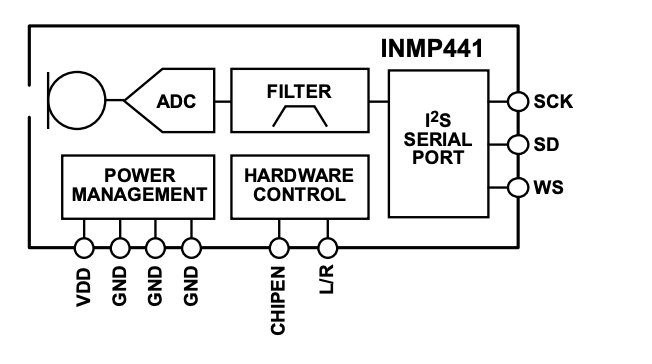

# Lorenzo Bujalil Silva's Notebook
- [02-05-2025 - Creation of repository for project](#02-05-2025---creation-of-repository-for-project)
- [02-11-2025 - First TA Meeting](#02-11-2025---first-ta-meeting)
- [02-14-2025 - Conceptualized model choices and added to block diagram](#02-14-2025---conceptualized-model-choices-and-added-to-block-diagram)
- [02-19-2025 - Looking into Whisper.cpp and starting build system](#02-19-2025---looking-into-whispercpp-and-starting-build-system)
- [02-20-2025 - Integrating Llama to Translation Pipeline](#02-20-2025---integrating-llama-to-translation-pipeline)
- [02-21-2025 - Reformatting directory code](#02-21-2025---reformatting-directory-code)
- [02-25-2025 - Building a an infastructure with multiple processes to query pipeline](#02-25-2025---building-a-an-infastructure-with-multiple-processes-to-query-pipeline)
- [02-26-2025 - Worked on some of the PCB Design Schematic](#02-26-2025---worked-on-some-of-the-pcb-design-schematic)
- [02-27-2025 - Simulated MCU with Socket Communication](#02-27-2025---simulated-mcu-with-socket-communication)
- [03-04-2025 - Flashing OS image onto Raspberry Pi CM5](#03-04-2025---flashing-os-image-onto-raspberry-pi-cm5)
- [03-10-2025 - PCB Design Review](#03-10-2025---pcb-design-review)
- [03-22-2025 - LCD Screen Programming](#03-22-2025---lcd-screen-programming)
- [04-06-2025 - MCU Change and ESP Firmware Start](#04-06-2025---mcu-change-and-esp-firmware-start)
- [04-08-2025 - Getting Audio Data from Microphone using ESP32 firmware](#04-08-2025---getting-audio-data-from-microphone-using-esp32-firmware)
- [04-09-2025 - Setting up the SPI interface protocol on the Pi to recieve the data](#04-09-2025---setting-up-the-spi-interface-protocol-on-the-pi-to-recieve-the-data)
---
# 02-05-2025 - Creation of repository for project

This day, we did some research on all of the different docuemation that we need for the devices that we are going to use for the project. We put all of the datasheets in the [`datasheets/`](./../../datasheets/) directory.

- [ICS-43434 Microphone Datasheet](./../../datasheets/ICS-43434(Microphone).pdf)
- [LM317 Regulator Datasheet](./../../datasheets/inmp441.pdf)
- [Raspberry Pi CM5 Datasheet](./../../datasheets/cm5-datasheet.pdf)
- [Amplifier Datasheet](./../../datasheets/MAX98357AEWL.pdf)
- [LCD Datasheet](./../../datasheets/ST7789(LCD).pdf)
- [STM32 Datasheet](./../../datasheets/STM32F40xxx.pdf)

---
# 02-11-2025 - First TA Meeting

### Objectives
- Refactor project repo.
- Get started building software infastructure.
- Set up lab notebook.
- Work on project proposal and block diagram.
### Tasks Completed
- Project repo created.
- Set up the speech to text transcription model.
- Created infastructure for lab notebook.
- Started work on the block diagram.

---

# 02-14-2025 - Conceptualized model choices and added to block diagram

We started working on a block diagram for our project:



In our base idea, we have a microcontroller controlling the audio peripherals and the user interface and then that can communicat with the Pi over some type of communication protocol. Since I am mainly working on the software for this project, I want to start get working on the inference pipeline to work. I started to do some research on what the best models are for this project.

After doing some research, I found a set of projects that are a good idea to use for the project since they have support for working on an embedded platform:

- Transcription: [Whisper.cpp](https://github.com/ggml-org/whisper.cpp)
- Translation: [Llama.cpp](https://github.com/ggml-org/llama.cpp)
- Synthesis: [Piper TTS](https://github.com/rhasspy/piper)

What I am mainly worried about is that I wont be able to get the Piper project working on my Mac because it is built around using funcitons exclusive to the Raspberry Pi system. I think however, I can build everything else.

---

# 02-19-2025 - Looking into Whisper.cpp and starting build system

I wanted to start getting work done on the whisper side of things, trying to get some of the examples working on whisper.cpp. I started development on my Mac M2 Pro.

Here are the specs for my Mac:

- Chip:	Apple M2 Pro
- Total Number of Cores: 12 (8 performance and 4 efficiency)
- Memory:	16 GB
- Storage: 1 TB

Here are the specs for the Raspberry Pi CM5:

- SoC: Broadcom BCM2712
    - CPU: Quad-Core Arm Cortex-A76 (64-bit)
- RAM: 8GB LPDDR4X-4267 SDRAM with ECC
- Storage: 32GB eMMC flash memory

I wanted to prototype a start of this model on the Mac to be able to determine the build system which can later be easily ported onto the Pi. Ideally the Pi is going to run Ubuntu and should work with compiling C++ code using a CMake build system with the necessary backend to work on the Raspberry Pi embedded platform.

According to the spec differences between the Pi and the Mac, we should have some problems later on with having multiple large models on the eMMC.


This is the base implementation for our build system, we will add more as we integrate more projects:

```Cmake
cmake_minimum_required(VERSION 3.10)
project(TranslationPipeline)

set(CMAKE_CXX_STANDARD 17)
set(CMAKE_CXX_STANDARD_REQUIRED ON)

find_package(Threads REQUIRED)

add_subdirectory(whisper.cpp)

add_subdirectory(pipeline)
```

I started getting the transcription project working by testing with a pcm audio generator accessing the microphone from my Mac to generate samples.

I ran into a simple bug with the model, since the whisper model only can interpret 32-bit audio I needed to extract first the 24-bit audio from the PCM file and then sign extend it to 32 bits and finally normalize the data.

---

# 02-20-2025 - Integrating Llama to Translation Pipeline

After getting samples working on the transcription, I added some timing support to be able to calculate how long the pipeline is taking to do its inference.

At this point we have transcription working by emulating some of the examples from the whisper project to be able to setup the configuration for inference on the whisper model we selected.

Today I am going to be working on integrating the llama project into the build system. A basit idea that i have right now is to build llama separately and then access the binary file from the main pipeline to query it along and get the output.

- Build Steps for Llama:
    ```bash
    git clone https://github.com/ggml-org/llama.cpp
    cd llama
    cmake -B build -DLLAMA_BUILD_TESTS=OFF
    cmake --build build --config Release
    ```

The main issues that come from this is that we are using a system call to spawn an entire new process for the translation. We need to do the same thing as before where we are setting up the configuration all within the main pipeline and integrate the project into the build system.

```Cmake
add_executable(pipeline main.cpp)

target_include_directories(pipeline PRIVATE ${CMAKE_SOURCE_DIR}/whisper)
target_include_directories(pipeline PRIVATE ${CMAKE_SOURCE_DIR}/llama)

target_link_libraries(pipeline PRIVATE whisper llama ${CMAKE_THREAD_LIBS_INIT})

set_target_properties(pipeline PROPERTIES RUNTIME_OUTPUT_DIRECTORY ${CMAKE_BINARY_DIR}/bin)

add_custom_target(run
    COMMAND ${CMAKE_BINARY_DIR}/bin/pipeline
    DEPENDS pipeline
    WORKING_DIRECTORY ${CMAKE_SOURCE_DIR}
)

```

After some work, I was able to integrate the llama project into the pipeline build system. I was able to build the entire project together and access functions from the llama project. Same as before, I followed example projects that have initalized the context and so on for the llama project to be able to run inference.

At this point in the project, we have both the transcription and the translation working in the main pipeline:

```c++
std::string transcribed_text = transcribe();
translate(transcribed_text);
std::string translated_text;
translate(transcribed_text, translated_text);

fprintf(stdout, "\nTranscribed text: \033[0;36m%s\033[0m\n\n", transcribed_text c_str()); // Cyan
fprintf(stdout, "Translated text: \033[0;32m%s\033[0m\n\n", translated_text.c_str()); // Green
```

---

# 02-21-2025 - Reformatting directory code

I was initially thinking about the idea of getting the code working on a docker container first before working locally on the Mac. The idea was that I was not able to get everything working with the compilers that are available on Mac and they would have problems translating with the build system that would be available on the Linux system of the Pi. I realized however that the projects that we are working on, whisper and llama, are both configured with build systems that have target backends for the resouces available on the Pi. I therefore decided that we can get rid of the docker ideas that I had initially and removed it entirely from the project.

---

# 02-25-2025 - Building a an infastructure with multiple processes to query pipeline

I need to make this project to be formatted in a way that can be reused without being so hardcoded. I want to build a infastructure where I can query the process externally, passing in the necessary information in some way.

What I decided I wanted to do is send a signal to the process from a seperate terminal. Here is some information about signaling between processes from the GNU documentation.

> **SIGUSR1** and **SIGUSR2**
>
> **Macro**: `int SIGUSR1`  
> **Macro**: `int SIGUSR2`  
>
> The SIGUSR1 and SIGUSR2 signals are set aside for you to use any way you want. They’re useful for simple interprocess communication, if you write a signal handler for them in the program that receives the signal.
>
> The **default action** is to **terminate** the process.

Here is an example that is referenced in the documentation for how to signal another process:

> **24.6.2 Signaling Another Process**
>
> The kill function can be used to send a signal to another process. In spite of its name, it can be used for a lot of things other than causing a process to terminate. Some examples of situations where you might want to send signals between processes are:
>
>
> - A parent process starts a child to perform a task—perhaps having the child running an infinite loop—and then terminates the child when the task is no longer needed. 
> - A process executes as part of a group, and needs to terminate or notify the other processes in the group when an error or other event occurs.
> - Two processes need to synchronize while working together.

This documentation provides me with the insight that I need to be able to synchronize multiple proceses. I think that it can come in use later on since I probably won't be able to code the entire project in C++.

So I am going to build a script that can send over the signal to start the pipeline process and simulate the MCU sending over the PCM data to the Pi. Then, since I am working on only sending over a signal to the process. I will be writing the configuration for the languages to a text file and then notifying the process that it can access the data now.

---

# 02-26-2025 - Worked on some of the PCB Design Schematic

I worked with Josh today on some of the inital implementation for the MCU schematic. We did some research about the way we are going to flash the MCU with firmware and what kind of pins we needed for reading data over I2S on the microphone and amplifer. We also needed to allocate some pins for the data transfer between the processing units. After decribing to Josh the necessary components, we decided on some of the pins that we were going to allocate to each of the sub units.



---

# 02-27-2025 - Simulated MCU with Socket Communication

I want to create some level of simulation from the MCU since we still don't have the development boards. Up to this point, I have been developing some python scripts that are creating 24-bit mono PCM audio files and then we have a process communication with signals to notify the pipeline that it can read the PCM data and the configuration for the translation.

It is also important to note that the speed of the pipeline right now is averaging about less than 2 to 3 seconds. I did have this weird issue with memory where, if I ran the pipeline multiple times, my memory would overload and it would cause some graphical errors to my Mac. I will need to investigate this a bit further later on.

So for simulation, I want to start writing the MCU code so that when we get the dev boards, I can hit the ground running and test the code. I came up with the idea to write the high level code for the HAL library on the STM platform. Then I would write the backend my self so that it would work on my own system. This would include firstly reading the I2S data from a simulated microphone that would stream packets of data to the MCU process and we could use the HAL I2S read function to read the data being streamed. Then I would use the same method to deliver the data to the pipeline process. The main way that I wanted to implement this simulation was with IPC sockets.



The main benefit of using a socket based approach, is that we are able to communicate between proceses locally through the filesystem on my UNIX-like system. This is an ideal approach because it would work on the Mac and the Pi when we are doing bringup. These sockets also provide the functionality of two way communication and can deliver more than just signals. We can provide actual data through the socket and do some handshaking to create a communicaiton platform.

This then was able to replace the idea of sending a signal interrupt to start the process but now we can setup a client and server socket to recieve the start sequence from the MCU simulated process.

---

# 03-04-2025 - Flashing OS image onto Raspberry Pi CM5

We received the Raspberry Pi Compute Module dev board, so I want to start working on flashing a fresh copy of an OS onto the flash chip on the compute module.  
I worked with the [raspberrypi/usbboot repository](https://github.com/raspberrypi/usbboot) to initiate the boot process over USB. We need to follow the steps to flash an OS onto the CM5 through USB on the IO expander:

> To set up the Compute Module 5 IO Board:
> 1. Connect the Compute Module to the IO board. When connected, the Compute Module should lie flat.
> 2. Fit nRPI_BOOT to J2 (disable eMMC Boot) on the IO board jumper.
> 3. Connect a cable from USB-C slave port J11 on the IO board to the host device.

Then on the host machine:

> To set up software on a macOS host device:
> 1. First, build rpiboot from source.
> 2. Connect the IO Board to power.
> 3. Then, run the rpiboot executable with the following command:
> ```rpiboot -d mass-storage-gadget64```
> 4. When the command finishes running, you should see a message stating "The disk you inserted was not readable by this computer." Click Ignore. Your Compute Module should now appear as a mass storage device.

Now that the board is a mass storage device we can flash the eMMC with the following command: ```sudo dd if=raw_os_image.img of=/dev/sdX bs=4MiB```. We simply need to select the image that we want to write over to the eMMC. 

Once the eMMC is flashed, we can boot from the eMMC by removing the jumper disabling the eMMC boot.

I also worked today on some base implemenation of a I2S consumer and generator method where I can stream the I2S data between processes, but I have a feeling that this implementation won't be worth continue working on because the actual firmware that will go on the MCU will be much different to access the microphone data.

---

# 03-10-2025 - PCB Design Review

I worked with Josh to do some review of the PCB design that we had to submit to be fabricated. We wanted to validate that there were no issues with our design and that it was inline with what we expected on the software perspective. This means that we validated the GPIO pins for each of the communicaiton protocols. We also made a major change here where we changed to use SPI instead of I2C for the communication between two chips. After doing some research, SPI has much faster data transfer rates where that is crucial to be able to stream large amounts of audio data. Also, it is more common to use I2C for peripheral devices instead of high data transfer.


---

# 03-22-2025 - LCD Screen Programming

I worked on getting some of the LCD screen code working. The LCD screen that we bought for this project has some documentation on line with some driver code to be able to write to the registers on the LCD over SPI through a configuration that works on the Raspberry Pi CM5 ([LCD Module Driver Code](https://www.waveshare.com/wiki/2inch_LCD_Module)). 



There are some base tests that the driver code has to display an image on the LCD screen and thats what you can see in the image above. Here we are using SPI0 on the Pi to be able to interface with the display. The documentation of the driver code also provides information about which pins to use to connect to the display.

From this point on, I want to use the driver code that provides primitives for text and lines to be able to make graphical display resembling a menu for languages.


---

# 04-06-2025 - MCU Change and ESP Firmware Start

We were having many issues getting our PCB to work the right way, and we are realizing that having a complicated microcontroller will cause major issues later on when we are doing bringup. We found that the microcontroller we decided to use was very complicated to build a PCB for, and with inital tests on the development board for reading data from the microcontroller going wrong. We decided that it is important to make a change in our MCU selection. We found out that an ESP32-S3 is much easier to implement on a PCB because of the smaller amount of pins, and the board has commonly found to work with the amplifier and microphone that we were using. One thing also to mention about the STM32, was the complicated nature of configuring the clocks for the I2S peripherals, I think that was one of the reasons that we were never able to get it working. After doing some research online, many projects use the ESP32 for accessing the I2S peripherals and the GPIO for this device was much more flexible especially for I2S. At this point, I communicated with Josh the pins that I want to use on the ESP32 and we can go from there to design a simpler PCB and get that fabricated.

We also realized that the ESP32 as more than enough processing power on two cores to be able to run multiple tasks to manage the I2S and the SPI communication. It was also much easier to configure an I2S bus on the ESP32.

```c
    const i2s_config_t i2s_config = {
        .mode = I2S_MODE_MASTER | I2S_MODE_RX,
        .sample_rate = 16000,
        .bits_per_sample = I2S_BITS_PER_SAMPLE_16BIT,
        .channel_format = I2S_CHANNEL_FMT_ONLY_LEFT,
        .communication_format = I2S_COMM_FORMAT_I2S,
        .intr_alloc_flags = 0,
        .dma_buf_count = dmaBufferCount,
        .dma_buf_len = dmaBufferLength,
        .use_apll = false,
        .tx_desc_auto_clear = false,
        .fixed_mclk = 0
    };
```


---

# 04-08-2025 - Getting Audio Data from Microphone using ESP32 firmware

I wanted to start interfacing with the microphone on the ESP by flashing some of the firmware that I wrote to read the audio data. Effectively I chose some of the available pins on the dev board for the ESP:

- I2S_SD = 10
- I2S_WS = 11
- I2S_SCK = 12
- I2S_PORT = I2S_NUM_0


Once I had my pins, I connected them physically to the INMP441 microphone:



On the microphone, I connected the appropriate signals to the right pins on the microphone and I tied the L/R pin to low because we are only using mono for this project.

Once I had the physical connections, I flashed the board and tested just printing out the digital values that I was reading from the mic. I wanted to test to see if there was any variation in the signal value when I would speak into the microphone. 

I had some inital errors with this because the values wouldnt change at all. So I went to the lab and connected the I2S signals from the ESP32 on the oscilloscope and validated the protocol values. What the issue was a physical connection for the WS pin to the microphone, after tightening the connection on the breadboard, it worked fully. I was able to see variations in the values from the microphone. Now, I could start working on the SPI communication to deliver the PCM data to the Pi.

---

# 04-09-2025 - Setting up the SPI interface protocol on the Pi to recieve the data

I worked on getting an interface working to be able to recieve data from the ESP32 over a SPI interface. This interface was difficult to get setup because of the restrictions for wav files.


WAV files require information about how many channels there are and the sample rate. If we are streaming data over SPI, we won't know exactly how long we are going to stream for, so I would setup this method where when we start streaming, we allocate a large buffer that can store the audio data and we setup all of the meta data before hand for the sample rate and the channels and the bytes per sample. Then as we collect data, I would load the buffer and extend it as needed. 

In order to notify the Pi to start polling data, I would send an interrupt from the ESP32 via GPIO to let it know that it should start polling the SPI interface.

That is another point to mention, since the Raspberry Pi doesn't have driver support for a SPI slave, I configured the ESP to act as a SPI slave and then use an interrupt to ask the master to get data from the slave. In this way the ESP32 is acting as a peripheral device capable of reading from the I2S audio.


