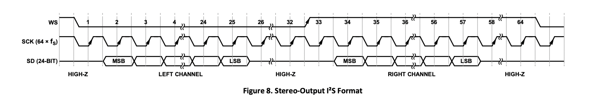

The image above shows the stereo output from the INMP441 microphone. This output represents the captured audio signals from the left and right channels, providing a spatial audio experience. The stereo output is crucial for applications requiring directional sound detection and localization.